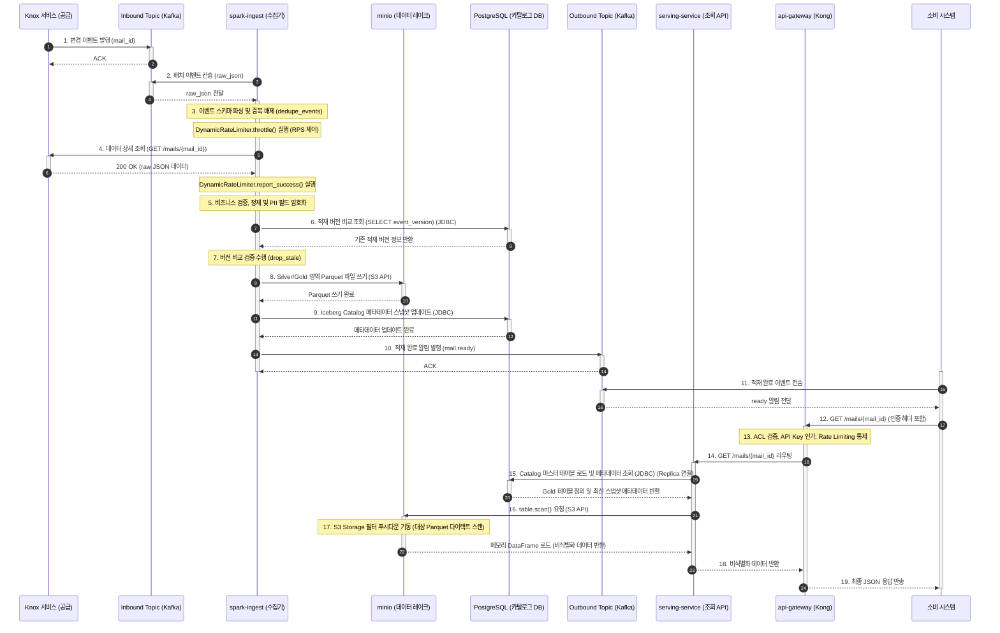
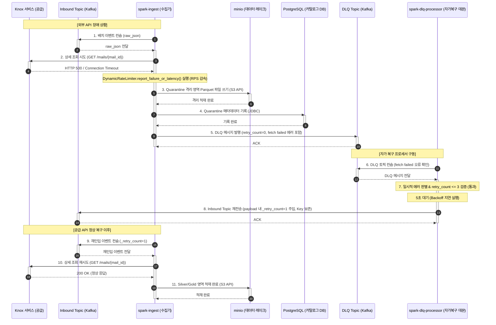

# C&C (Component & Connector) 다이어그램 정의서

본 문서는 통합 데이터 플랫폼의 실시간 데이터 수집, 자가 복구 파이프라인 및 데이터 서빙 영역을 정의한 C&C 다이어그램(`cnc_diagram.svg`)의 기술 명세서임. 
각 컴포넌트 간 물리적·논리적 경계와 인터페이스 프로토콜을 정의하여 개발 및 운영 단계의 표준 기준으로 활용함.

## 1. 개요

통합 데이터 플랫폼의 **실시간 Spark 스트리밍 및 자가 복구형 DLQ 프로세서 기반 데이터 수집 아키텍처**를 정의함.
대용량 메시지 버퍼(Kafka), 분산 스트리밍 엔진(Spark Structured Streaming), 독립형 자가 복구 프로세서(DLQ Processor), 트랜잭션 데이터 레이크(Iceberg on MinIO)를 통합 연계하여 장애 발생 시에도 가용성을 유지하고 데이터 최종 정합성을 안정적으로 유지하도록 설계됨.

## 2. 주요 컴포넌트(Component) 정의

### A. 플랫폼 외부 시스템 (External Systems)
* **공급 시스템 (Knox 서비스)**
  * 메일, 일정, 결재 등 사내 임직원 시스템 데이터 원천.
  * 변경 이벤트 생산 및 데이터 본문 상세 조회를 위한 RESTful API 제공.
* **소비 시스템 (검색 / Graph / 모바일 서비스)**
  * 플랫폼에 정제·적재 완료된 최종 데이터를 활용하는 외부 연계 서비스.
  * 적재 완료 이벤트를 구독하여 후속 처리를 트리거하거나, API Gateway를 통해 데이터를 실시간 조회함.

### B. 실시간 수집 및 자가 복구 영역 (Ingestion & Self-Healing)
* **Inbound Topic (`mail.events`)**
  * 원천 시스템에서 발행된 실시간 변경 데이터를 1차 수용하는 수집용 Kafka 토픽.
  * 피크타임(2.22 GB/s) 급격한 트래픽 유입에 대한 완충(Buffer) 역할을 수행함.
* **Ingest Processor (`spark-ingest`)**
  * Spark Structured Streaming 기반의 분산 데이터 수집 프로세스.
  * Inbound Topic으로부터 이벤트를 수집하여 스키마 검증 및 개인정보(PII) 암호화를 거쳐 데이터 레이크에 적재함.
  * 연계 API 장애 발생 시 에러 격리 적재(Quarantine) 및 DLQ 토픽 송출을 처리함.
* **DLQ Topic (`mail.events.dlq`)**
  * 처리 과정에서 장애/오류가 발생한 메시지를 임시 격리하는 데드 레터 큐(Dead Letter Queue) 토픽.
  * 장애 이벤트를 비동기로 우회시켜 수집 파이프라인의 병목(Head-of-Line Blocking)을 차단함.
* **DLQ Processor (`spark-dlq-processor`)**
  * 메인 수집 엔진과 격리되어 기동되는 독립형 Python 데몬 프로세스.
  * DLQ 토픽의 에러 메시지를 컨슘하여 일시적 네트워크 장애인 경우 5초 대기(Backoff) 후 최대 3회 재시도 제한(MAX_RETRIES = 3) 하에 원래의 Inbound Topic으로 재전송(Redrive)함.

### C. 데이터 레이크 및 스토리지 영역 (Data Lake & Catalog)
* **PostgreSQL (Iceberg Catalog)**
  * Apache Iceberg의 스키마, 파티션 이력 및 메타데이터 경로를 관리하는 트랜잭션 카탈로그 DB.
  * 락(Lock) 경합 방지를 위해 수집(Write)은 Primary DB에, 조회(Read)는 Read-Replica에 세션을 분리하여 연결함.
* **minio (S3 API - Data Lake, Iceberg)**
  * Apache Iceberg 물리 데이터 파일(Parquet)이 영구 적재되는 분산 오브젝트 스토리지.
  * 정상 정제 영역(Silver/Gold)과 분석용 에러 격리 영역(Quarantine)을 디렉토리 수준에서 격리하여 관리함.

### D. 데이터 서빙 영역 (Data Serving)
* **serving-service (Data Serving)**
  * 외부 소비 시스템의 실시간 조회 요청을 처리하는 데이터 제공 API 서비스.
  * 데이터 레이크 및 카탈로그 DB와 연동하여 표준화된 정제 데이터를 외부로 송출함.
* **api-gateway (Kong)**
  * 서빙 서비스 전면에서 라우팅, 보안 검증, Role-Based ACL, Dynamic Rate Limiting을 수행하는 인가 통제 관문.
* **Outbound Topic (`mail.ready`)**
  * 데이터 수집 및 데이터 레이크 적재가 완료되었음을 알리는 완료 통지용 Kafka 토픽.
  * 다운스트림 소비 시스템이 해당 알림을 구독하여 인덱싱, 초안 작성 등의 후속 작업을 시작할 수 있도록 트리거 역할을 함.

## 3. 커넥터 및 프로토콜 (Connector & Connector)

다이어그램의 선(Line) 및 화살표 속성에 정의된 연계 규격과 프로토콜 정의.

| 연계 종류  | 적용 프로토콜 | 설명 및 제어 정책 |
| :---  | :--- | :--- |
| **Kafka Protocol**  | TCP / Kafka Wire | • 공급계 ➔ Inbound Topic 연계 • Inbound/DLQ/Outbound Topic ➔ 수집/처리 엔진 간 비동기 메시지 연계 • 실시간 순서 보장을 위해 메시지 Key(`mail_id`) 보존 적용 |
| **RESTful API**  | HTTP/JSON (REST) | • 수집 엔진 ➔ 공급 API 실시간 본문 동기식 조회 • 소비 시스템 ➔ Kong API Gateway ➔ 서빙 서비스 간 초저지연 데이터 서빙 |
| **JDBC**  | PostgreSQL Driver | • Spark 수집 엔진 및 서빙 서비스 ➔ PostgreSQL Catalog DB 메타데이터 트랜잭션 처리 • 데이터 경합 방지를 위해 수집(Primary) 및 조회(Replica) 연결 세션 분리 적용 |
| **S3 API**  | Amazon S3 API | • Spark 수집 엔진 ➔ MinIO 스토리지 대용량 Parquet 파일 쓰기 • 서빙 서비스 ➔ MinIO 스토리지 데이터 파일 읽기 |

## 4. 핵심 시나리오별 상세 시퀀스 흐름 (Sequence Diagrams)

C&C 다이어그램에 정의된 주요 컴포넌트들을 기준으로 설계된 대표 시나리오 2종에 대한 정밀 시퀀스 명세임.

### 시나리오 A: 평시 실시간 정상 수집 및 데이터 서빙 흐름 (Normal Ingestion & Serving Flow)

원천 Knox 서비스의 변경 이벤트를 실시간 비동기 수집하여 스키마 검증, PII 암호화, 중복/버전 검증을 거쳐 데이터 레이크(minio Silver/Gold)에 적재하고 소비 시스템에 완료를 통지한 후, 소비 시스템이 게이트웨이를 거쳐 서빙 서비스로 API 조회를 요청하여 비식별화된 데이터를 획득하는 전 과정(E2E Happy Path)임.

#### [수집 단계] 데이터 수집 및 데이터 레이크 적재 흐름
1. **이벤트 감지**: Knox 서비스에서 데이터 변경 발생 시 **Kafka Protocol**로 플랫폼 `Inbound Topic`에 이벤트를 발행함.
2. **배치 수집**: `spark-ingest`가 배치 단위로 이벤트를 컨슘함.
3. **스키마 검증 및 중복 필터링**: `spark-ingest` 내부에서 수집 이벤트의 JSON 구조 및 `mail_id` 유효성을 검증하고, 동일 배치 내 동일 식별자의 중복 요청을 제거함.
4. **원천 상세 조회**: `DynamicRateLimiter.throttle()`로 수집 속도를 제어한 뒤, Knox 서비스의 상세조회 API(`GET /mails/{mail_id}`)를 **RESTful API**로 동기 호출하여 데이터를 병합함. 성공 시 RPS 제한 속도를 안정적으로 가속함.
5. **정제 및 PII 암호화**: 비즈니스 유효성 검증과 텍스트 정제를 거친 후, 개인정보(PII) 대상 필드를 단방향/양방향 암호화 처리함.
6. **버전 순서 검증**: `PostgreSQL (카탈로그 DB)`에 연결하여 기존 적재 데이터의 `event_version`을 조회하고 비교함으로써 역류(Stale) 이벤트를 필터링함.
7. **최종 적재**: `minio (데이터 레이크)` 스토리지에 Parquet 파일 쓰기를 호출하고 동시에 PostgreSQL Catalog Primary DB에 트랜잭션 메타데이터를 갱신 커밋함.
8. **완료 통지**: `Outbound Topic`(`mail.ready`)으로 완료 알림을 발행하여 소비 시스템(검색 등)이 후속 조회를 수행하도록 트리거함.

#### [조회 단계] 온디맨드 데이터 제공 흐름
9. **조회 인입**: 완료 알림을 수신한 소비 시스템이 조회를 요청하면 `api-gateway (Kong)`가 인가를 수행하고 `serving-service`로 라우팅함.
10. **메타데이터 조회**: `serving-service`가 PostgreSQL Read-Replica(**JDBC**)를 통해 대상 Iceberg 테이블의 메타데이터 및 스펙 정보를 획득함.
11. **스토리지 파싱**: PyIceberg의 `table.scan()` 필터 푸시다운 제어를 통해, JVM 오버헤드 없이 `minio (데이터 레이크)` 내의 실제 물리 Parquet 파일의 슬롯만 S3 API로 직접 타격 및 스캔하여 인메모리 로드함.
12. **데이터 반송**: 조회 및 비식별화된 상태 그대로 최종 JSON 데이터를 반송함.

---

### 시나리오 B: 공급 API 장애 시 격리 및 자가 복구 (Self-Healing Flow)

원천 Knox 서비스의 통신 장애 발생 시 실패 건을 minio 격리(Quarantine) 영역 및 DLQ 토픽으로 송출하고, 자가 복구 프로세서(spark-dlq-processor)가 지연 대기 후 원래 인입 토픽으로 재진입시켜 복구 처리를 지원하는 흐름임.

1. **장애 감지**: `spark-ingest` 엔진 구동 중 Knox 서비스의 연계 실패를 감지하고, DynamicRateLimiter를 통해 수집 속도(RPS)를 감속하여 시스템을 안정화함.
2. **오류 격리**: 정상 수집 흐름이 차단되지 않도록, 장애 데이터 정보를 조립하여 `minio (데이터 레이크)`의 Quarantine 격리 디렉토리에 백업하고 카탈로그 DB에 기록함.
3. **DLQ 송출**: 동시에 에러 원인 및 상태값을 포함하여 `DLQ Topic`(`mail.events.dlq`)으로 비동기 발행함 (최초 발행이므로 `retry_count=0`).
4. **오류 분석 및 대기**: 독립 가동 중인 `spark-dlq-processor` 데몬이 DLQ 토픽의 에러를 컨슘하고 일시적 통신 오류로 판별 시 재시도 상한값(3회) 미만 조건을 검증한 뒤 **5초의 대기 지연(Backoff)**을 강제함.
5. **재인입(Redrive)**: 프로세서가 페이로드 내에 `_retry_count=1` 정보를 갱신 주입하고, 원래 인입 경로인 `Inbound Topic`으로 재전송함 (메시지 정렬 보장을 위해 `mail_id` Key 바이트를 그대로 유지하여 발행).
6. **복구 완수**: 공급 API가 복구된 후, 재진입한 이벤트가 메인 수집기에 의해 정상 가공되어 `minio` 내 Silver/Gold 영역으로 안전하게 적재 완료됨.

## 5. 아키텍처 패턴: Claim-Check 패턴 적용 구조

본 플랫폼은 대용량 메시지 전송에 따른 Kafka 메시지 전송 제약(기본 1MB 임계치 한도)을 회피하고 메시징 시스템의 입출력 성능(Throughput)을 극대화하기 위해 **Claim-Check 패턴**을 설계에 적용함. 
특히 본 패턴은 **데이터 수집 부문**과 **데이터 서빙 부문**에 각각 이원화되어 독립적으로 설계되었으며, 이를 통해 각 연계 영역의 인프라 및 시스템 안정성을 확보함.

### A. 적용 구조 및 데이터 흐름 명세
1. **[수집 부문] Claim-Check 발행 (Knox ➔ Inbound Topic)**
   - Knox 원천 시스템은 1MB 평균 크기의 메일 데이터 전체를 Kafka 메시지에 직접 실어 보내지 않고, 이벤트 발생 정보와 식별키(`mail_id`)만을 포함한 경량 이벤트(Claim-Check)를 `Inbound Topic`으로 발행함.
2. **[수집 부문] 원천 데이터 획득 (Inbound Topic ➔ Ingest Processor ➔ Knox)**
   - `spark-ingest` 엔진은 수집한 식별키(`mail_id`)를 기반으로 Knox 서비스의 상세조회 API(`GET /mails/{mail_id}`)를 동기식 호출하여 본문 등의 대용량 데이터를 연계 취득함. (이벤트 메시지와 실제 데이터의 분리)
3. **[서빙 부문] 대용량 파일 적재 및 Ready 알림 (Ingest ➔ MinIO ➔ Outbound Topic)**
   - 정제 및 비식별 암호화가 완료된 대용량 canonical 데이터는 분산 오브젝트 스토리지(`MinIO`)에 물리 Parquet 파일로 직접 적재함.
   - 적재 완료 시점에는 `Outbound Topic`(`mail.ready`)으로 오직 `{"mail_id": mail_id, "status": "ready"}`의 경량 완료 이벤트(Claim-Check)만을 발행하여 Kafka 브로커의 I/O 부하 및 디스크 점유율을 최소화함.
4. **[서빙 부문] 소비자 데이터 수신 (소비 시스템 ➔ Gateway ➔ 서빙 서비스 ➔ MinIO)**
   - ready 알림을 수신한 소비 시스템(검색 등)은 `Kong API Gateway` 및 `serving-service`를 통해 `mail_id`로 조회를 요청하여 최종 정제된 대용량 데이터를 온디맨드(On-demand)로 획득함.

### B. 각 부문별 최적화 효용 및 수혜 대상 명세

#### 1) 데이터 수집 부문 아키텍처적 이점 (수혜 컴포넌트: Ingest Kafka 버퍼 클러스터)
* **네트워크 대역폭 포화 방지**: 피크타임(2.22 GB/s, 2222 TPS) 유입 시, 대용량 본문이 메시지 버퍼에 직접 인입되지 않아 **Ingest Kafka 브로커의 네트워크 카드(NIC) 대역폭 포화와 메모리/디스크 부하 유발 요인이 최소화**됨.
* **수집 버퍼 고속성 및 고가용성 확보**: 버퍼 토픽이 순수 제어 신호만을 중개하므로 지연 시간 최소화 및 고속 TPS 소화에 용이하며, 대용량 파일 I/O는 분산 처리되는 Spark 엔진이 전용 백플레인 네트워크를 통해 다이렉트로 소화함으로써 **수집 버퍼 클러스터의 안정성과 확장성 확보에 기여**함.

#### 2) 데이터 서빙 부문 아키텍처적 이점 (수혜 컴포넌트: Ready Kafka 채널 및 다운스트림 소비 시스템)
* **인프라 비용 최소화**: 소비용 Kafka 채널의 메시지가 바이트 단위의 경량 포인터 정보로 압축되어 **Ready Kafka 브로커의 디스크 I/O 비용 및 보관을 위한 디스크 스페이스 점유를 억제하고 스토리지 비용을 완화**함.
* **소비 시스템 리소스 보호 (Pull 기반 온디맨드 소비)**: 외부 소비 시스템(검색, Graph, 모바일)들은 데이터 폭주 상황에서도 Kafka를 통해 대량의 페이로드를 Push-down 받지 않고, **적재 완료 알림 수신 후 자체 자원 상황과 비즈니스 처리 속도에 맞춰 API 게이트웨이로 실제 데이터를 Pulling(On-demand)** 함. 이를 통해 소비 시스템의 버퍼 오버플로우 및 자원(CPU, Memory) 급증에 따른 장애 임계 상황을 완충함.

## 6. 아키텍처적 품질 속성(QA) 보장 수준

본 C&C 다이어그램의 컴포넌트 배치 및 물리 격리, 그리고 커넥터 설계는 시스템의 가용성, 정합성, 성능 수준을 보장함.

1. **가용성 (Availability) - 연계 장애 회복**:
   * 외부 시스템의 실시간 통신 장애 시 파이프라인 전체 장애로 확산되지 않도록 단일 장애 지점(SPOF) 리스크를 최소화함.
   * `DLQ Topic`으로의 비동기 우회 격리 및 `DLQ Processor` 데몬의 Backoff 재시도 제어를 통해, 운영자 수동 개입을 배제한 **자동 자가 복구(Self-Healing) 구조**를 지원함.
2. **데이터 정합성 (Consistency) - 일관성 보장**:
   * 비동기 재처리 흐름 상에서 발생할 수 있는 이벤트 순서 역전(Out-of-Order) 현상에 대응하기 위해, 버전 비교 검증(`drop_stale`) 알고리즘을 탑재하여 구버전 데이터가 신버전 데이터를 덮어쓰는 역류 현상을 방지함.
   * `Apache Iceberg` 스토리지의 ACID 트랜잭션 및 멱등적(Idempotent) Upsert를 통해 중복 인입이 발생하더라도 최종 데이터 정합성을 유지함.
3. **성능 보호 및 Noisy Neighbor 차단**:
   * 대용량 수집(Ingest) 프로세스와 사용자 조회(Serving) 프로세스를 물리적 노드 및 논리적 Namespace 수준에서 엄격히 분리하여 컴퓨팅 자원 간섭을 차단함.
   * PostgreSQL 카탈로그 DB 세션을 Primary(Write)와 Replica(Read)로 이중화하고, 오브젝트 스토리지 I/O와 분리된 서브넷 망을 적용하여 피크타임 부하 집중 시에도 서빙 조회 성능 저하를 방어함.
